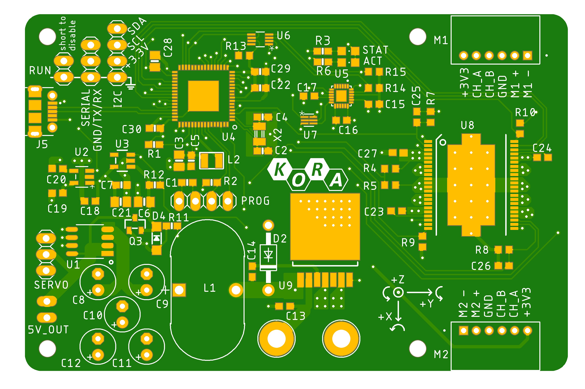
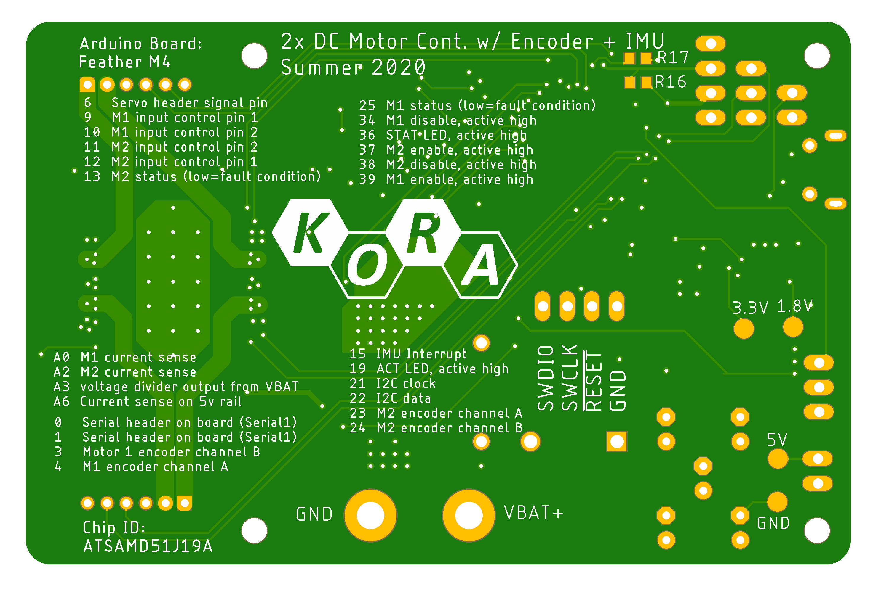
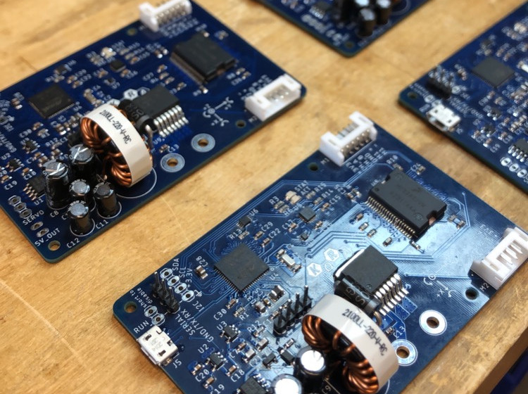

# Small Bot Motor Control Shield
This PCB makes building an advanced robot very simple. An onboard 32 bit ARM processor coordinates the control of 2 motors, as well as monitoring encoders on these motors for wheel odometry for the robot. There is a 9 axis IMU on the board to provide inertial odometry as well. a 5v @5A regulator provides enough power for most single board computers

### Board renders

### Assembled boards

### Demonstration

[https://youtu.be/KzK6t1kKt98](https://youtu.be/KzK6t1kKt98)
